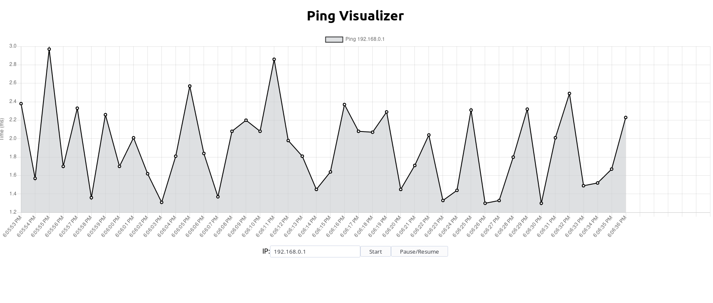

# ping-vis
A simple ping visualization tool. Created with React and Express.js

The purpose of the project was 

1. To learn a frontend framework
2. To visualize my ping to debug network issues

## Backend
A simple express server that runs unix 'ping' and sends the result via Server Sent Events (SSE). 

This approach was used as from my research pinging directly from the browser without a backend is wildly innacurate and would not be helpful in debugging. As I am only sending events in one direction (Server->Client) SSE was a suitable option, it is simple and supported by Chrome/Firefox.

## Frontend
I chose to use React as it is (one of) the most popular frontend frameworks. I used Charts.js to plot the data received from the server.

## Usage
Concurrently run the backend and frontend
> npm run dev

Hit start on the website with a valid address and it will begin. 

Note: Pausing ignores and drops the data from the server until it is resumed.
## Screenshot
